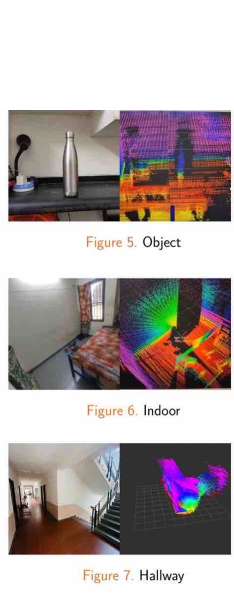

# 3D-RECONSTRUCTION-AND-MAPPING-USING-2D-LIDAR
A versatile system including software integration for the movement of the rover, receiving data from the 2D lidar, interfacing the 2D lidar data to the master control system, and maneuvering the rover to map different locations of the environment. 3D Lidar data is acquired simultaneously and in real-time.

Software Requirments:

	Ubuntu 18 or Ubuntu 20 on rpi for installation of ROS melodic/noetic
	ROS has to be installed,if not follow the steps below
	YD Lidar package has to be installed,if not follow the steps below
	VNC Viewer has to be installed

Hardware Requirments:

	Rpi 4GB RAM or above
    YD LiDAR X4

Follow the steps below to install ROS:

	sudo sh -c 'echo "deb http://packages.ros.org/ros/ubuntu $(lsb_release -sc) main" > /etc/apt/sources.list.d/ros-latest.list'
	sudo apt install curl
	curl -s https://raw.githubusercontent.com/ros/rosdistro/master/ros.asc | sudo apt-key add -
	sudo apt update
	sudo apt install ros-noetic-desktop-full
	source /opt/ros/noetic/setup.bash
	echo "source /opt/ros/noetic/setup.bash" >> ~/.bashrc
	source ~/.bashrc
	sudo apt install python3-rosdep python3-rosinstall python3-rosinstall-generator python3-wstool build-essential
	sudo apt install python3-rosdep
	sudo rosdep init
	rosdep update

Follow the steps to install YD Lidar package:

	In Home directory do,

	Step 1:YDLidar-SDK Installation

		sudo apt install cmake pkg-config
		sudo apt-get install python swig
		sudo apt-get install python-pip
		git clone https://github.com/YDLIDAR/YDLidar-SDK.git
		cd YDLidar-SDK/build
		cmake ..
		make
		sudo make install

	Step 2:YD Lidar ros package Installation

		git clone https://github.com/YDLIDAR/ydlidar_ros_driver.git ydlidar_ws/src/ydlidar_ros_driver
		cd ydlidar_ws
		catkin_make
		source ./devel/setup.sh
		echo "source ~/ydlidar_ws/devel/setup.bash" >> ~/.bashrc
		source ~/.bashrc
		echo $ROS_PACKAGE_PATH
		chmod 0777 src/ydlidar_ros_driver/startup/*
		sudo sh src/ydlidar_ros_driver/startup/initenv.sh

Execution Steps:

	Initialisation:

		Step 1:Extract and Copy the folder to  ydlidar_ws/scr/ydlidar_ros_driver directory
		Step 3:Run "sudo chmod +x rotate_frame.py" in ydlidar_ros_driver folder to give the python file execution permission

	Execution:
		
		roslaunch ydlidar_ros_driver lidar_view.launch 

Images:
	
	

